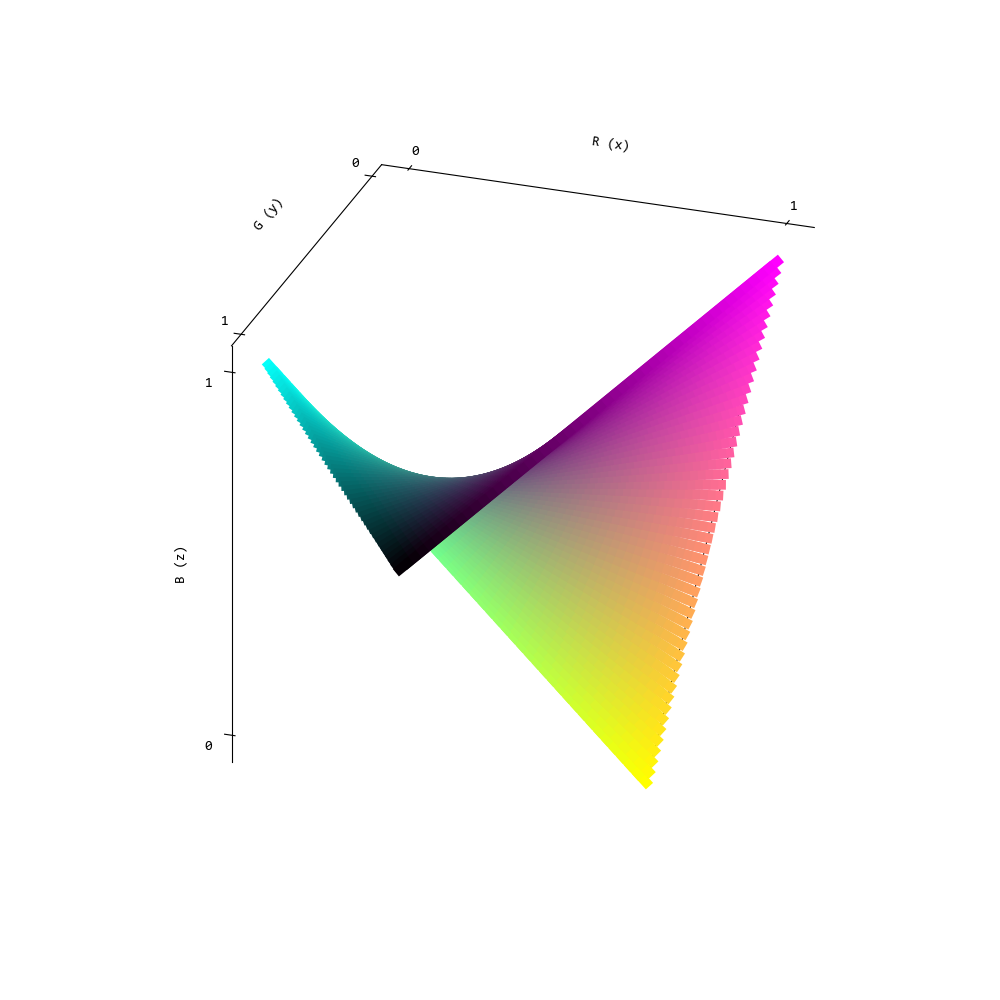
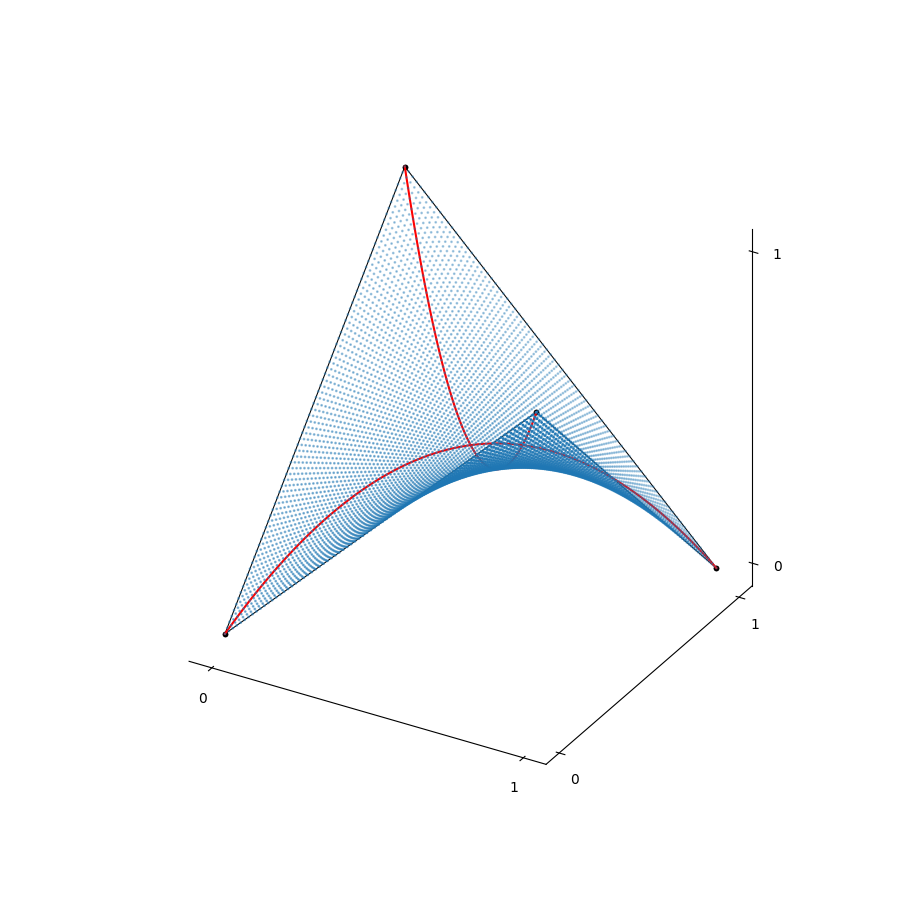
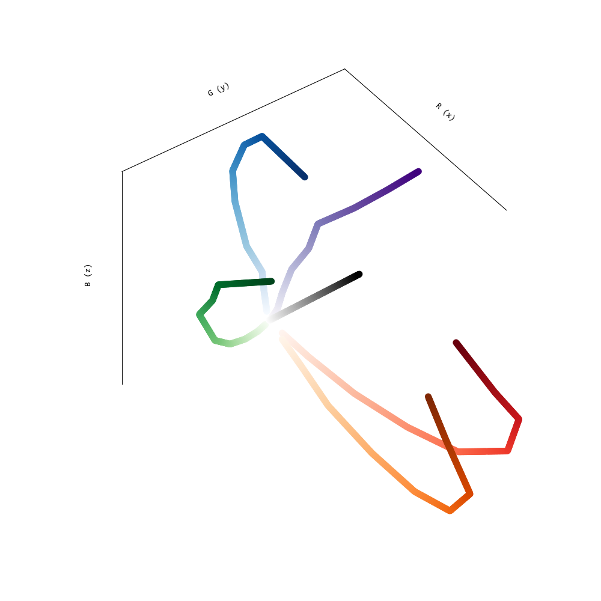
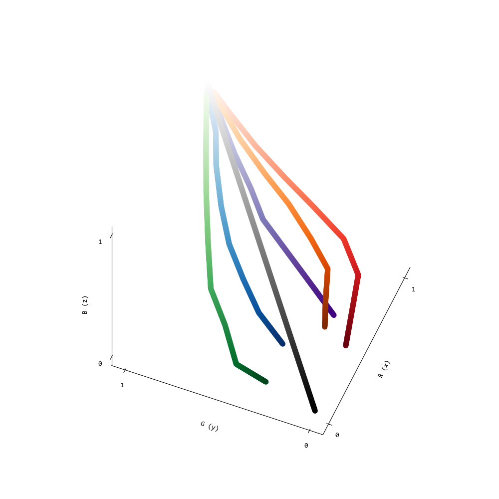

# RGB_ColorSpline_Cube

Defining colormaps Bézier surfaces has a lot of benefits. First, minimal data storage, because you only save the coordinates of the control points. Second, the are altready parametrized, so rate of change within the colormap will be perceptually uniform. Third, manually-crafted colormaps can be approximated (and therefore perceptually improved) with this method.

Event Horizon Telescope used the `afmhot` colormap to visualize the M87 black hole

Unit Circle (Trigonometric)
Unit Circle (Parametric)

3D Spiral (plt.scatter)
3D Spiral (plt.plot)

Bezier Spline
Bezier Surface

Barycentric Coordinates

Bezier Subdivision
Quadratic corner cutting (Chaikin)
Cubic corner cutting
4-point scheme

Spline parametrization, curvature, normal, tangent

OBJ meshes
